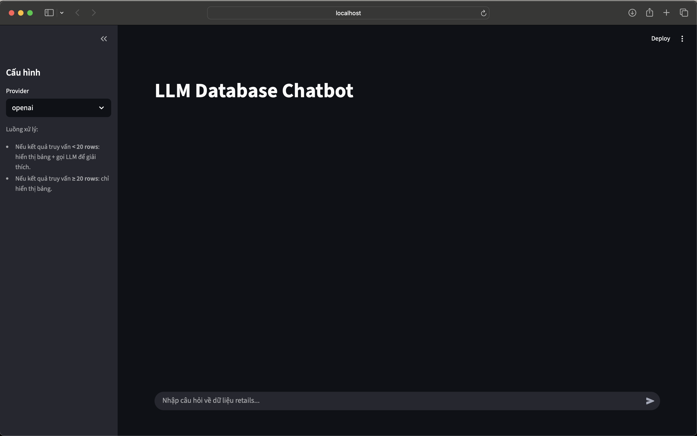
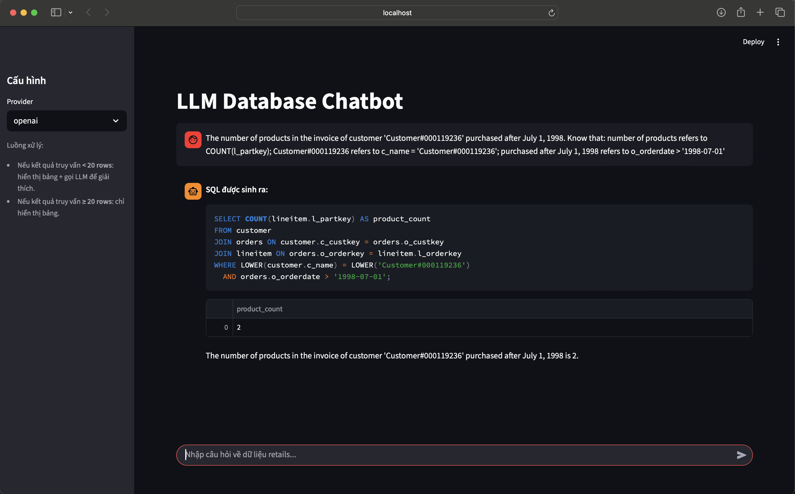

## Giới thiệu

Repo này xây dựng một **LLM Database Chatbot** cho bộ dữ liệu BIRD chỉ một khía canh `retails`, bao gồm:
- **Text-to-SQL** sinh câu lệnh SQL từ câu hỏi tự nhiên.
- **FAISS + SentenceTransformer** để tạo **table schema embedding** và truy hồi schema phù hợp.
- **LangGraph pipeline** cho chatbot CLI và **Streamlit UI** cho demo web.
- **Evaluation** cho Text-to-SQL với 2 metric: **VES** và **Execution Accuracy** trong `evaluation.py`.

Repo hỗ trợ cả **OpenAI (`gpt-5-mini`)** và **model open-source qua Ollama**.

---

## 1. Chuẩn bị môi trường & cài đặt virtual environment

Yêu cầu:
- Python 3.10+
- `sqlite3` đã cài sẵn (macOS mặc định có)

### 1.1. Tạo và kích hoạt virtual environment (venv)

```bash
cd /Users/huynhanhkiet/Desktop/Master-UIT/LLM-Database

# Tạo venv
python -m venv .venv

# Kích hoạt (macOS / Linux)
source .venv/bin/activate

# (Nếu dùng Windows PowerShell)
# .venv\Scripts\Activate.ps1
```

### 1.2. Cài đặt dependencies

```bash
pip install --upgrade pip
pip install -r requirements.txt
```

---

## 2. Cấu hình LLM: OpenAI (`gpt-5-mini`) và Ollama (open-source)

Code LLM được cấu hình trong `src/llm_models.py` và được chọn qua tham số `provider` trong `invoke_llm_database`.

### 2.1. Sử dụng OpenAI (`gpt-5-mini`)

1. Tạo file `.env` trong thư mục project:

```bash
cd /Users/huynhanhkiet/Desktop/Master-UIT/LLM-Database
touch .env
```

2. Thêm API key:

```bash
echo "OPENAI_API_KEY=sk-xxxxxxx" >> .env
```

3. Các chỗ sử dụng:
   - `evaluation.py` (gọi trực tiếp OpenAI client, model `gpt-5-mini`).
   - Pipeline chatbot trong `src/nodes.py` thông qua `OpenAILLM` (model name đặt trong code).
   - Ứng dụng `streamlit_app.py` và `main.py` truyền `provider="openai"`.

### 2.2. Sử dụng model open-source với Ollama

1. Cài Ollama (trên macOS):

```bash
brew install ollama
```

2. Tải model open-source (ví dụ `qwen2.5-coder:7b` – hoặc model bạn muốn):

```bash
ollama pull qwen2.5-coder:7b
```

3. Đảm bảo Ollama server đang chạy:

```bash
ollama serve
```

4. Trong config / code (thường trong `src/nodes.py` hoặc `configs/config.yaml`), đặt:
   - `provider="ollama"`
   - `model_name="qwen2.5-coder:7b"` (hoặc tên model bạn dùng).

> Lưu ý: `streamlit_app.py` cho phép chọn provider trong sidebar; `main.py` chọn provider trong code.

---

## 3. Tạo Table Schema Embedding

File chính: `src/embedding_table_schema.py`  
Input:
- `data/train_tables_retails.json`: thông tin schema logic (tên bảng, cột, khóa…)
- CSV mô tả cột trong `data/retails/database_description/*.csv`  
Output:
- `data/retails/table_schema.index`
- `data/retails/table_metadata.json`

### 3.1. Chạy script tạo embedding

Đảm bảo venv đã được kích hoạt và dependencies (FAISS, sentence-transformers) đã cài.

```bash
cd /Users/huynhanhkiet/Desktop/Master-UIT/LLM-Database
python -m src.embedding_table_schema
```

Sau khi chạy thành công, bạn sẽ thấy log tương tự:
- `✅ Indexed ... tables into data/retails/table_schema.index`
- `✅ Metadata saved to data/retails/table_metadata.json`

> Hệ thống Text-to-SQL trong runtime sử dụng file `table_schema.index` và `table_metadata.json`. Bạn có thể copy/đổi tên theo nhu cầu (hoặc chỉnh trong `src/utils.py`).

---

## 4. Chạy evaluation (`evaluation.py`)

File `evaluation.py`:
- Đọc file test Text-to-SQL từ `data/test_text2sql.json`
- Với mỗi sample:
  - Gọi OpenAI model `gpt-5-mini` (không sử dụng evidence retrieval, dùng toàn bộ schema).
  - Tính **VES** và **Execution Accuracy**.
  - Ghi kết quả vào CSV trong `data/evaluation/`.

### 4.1. Cấu trúc file dữ liệu đánh giá (ví dụ)

Ví dụ 1 entry trong `data/test_text2sql.json` (dòng 8-13 đã có sẵn trong repo):

```json
{
    "db_id": "retails",
    "question": "The number of products in the invoice of customer 'Customer#000119236' purchased after July 1, 1998.",
    "evidence": "number of products refers to COUNT(l_partkey); Customer#000119236 refers to c_name = 'Customer#000119236'; purchased after July 1, 1998 refers to o_orderdate > '1998-07-01'",
    "SQL": "SELECT COUNT(lineitem.l_partkey) AS number_items FROM customer JOIN orders ON customer.c_custkey = orders.o_custkey JOIN lineitem ON orders.o_orderkey = lineitem.l_orderkey WHERE customer.c_name = 'Customer#000119236' AND date(orders.o_orderdate) > date('1998-07-01')"
}
```

Bạn có thể thêm nhiều sample khác theo đúng cấu trúc trên.

### 4.2. Chạy evaluation

```bash
cd /Users/huynhanhkiet/Desktop/Master-UIT/LLM-Database

# Đảm bảo .env đã có OPENAI_API_KEY
python evaluation.py
```

Kết quả:
- Chạy lần lượt qua các sample trong `data/test_text2sql.json`.
- In ra console: câu SQL dự đoán, VES, Execution Accuracy.
- Ghi file CSV (ví dụ `result_qwen2.5-coder-7b-without_evidence.csv`) trong `data/evaluation/`.

---

## 5. Chạy chatbot LangGraph qua `main.py`

File: `main.py`  
Pipeline LangGraph được định nghĩa trong `src/graph.py` và các node trong `src/nodes.py`.

### 5.1. Chỉnh câu hỏi & provider

Trong `main.py`:
- Sửa biến `user_query` để đặt câu hỏi bạn muốn.
- Sửa `provider`:
  - `"openai"` để dùng OpenAI (cần `OPENAI_API_KEY`).
  - `"ollama"` để dùng model open-source qua Ollama.

Ví dụ (mặc định trong code):

```python
provider = "openai"
```

### 5.2. Chạy chatbot từ command line

```bash
cd /Users/huynhanhkiet/Desktop/Master-UIT/LLM-Database
python main.py
```

Luồng xử lý:
- LangGraph thực hiện:
  1. Node `text2sql_node`: sinh SQL từ `user_query`.
  2. Node `db_query_node`: thực thi trên `data/retails/retails.sqlite`.
  3. Node `llm` (tùy số lượng rows): sinh câu trả lời tự nhiên nếu số row nhỏ.
- Kết quả và log được ghi thêm trong `logs/app.log`.

---

## 6. Chạy demo chatbot web với `streamlit_app.py`

File: `streamlit_app.py`  
Giao diện web đơn giản cho chatbot LLM Database.

### 6.1. Giao diện demo Streamlit

Ảnh minh họa giao diện chatbot:



Khi người dùng đặt câu hỏi và hệ thống trả lời:



### 6.2. Chạy Streamlit app

```bash
cd /Users/huynhanhkiet/Desktop/Master-UIT/LLM-Database

# Đảm bảo venv đã kích hoạt & dependencies đã cài
streamlit run streamlit_app.py
```

Mặc định, Streamlit sẽ mở ở địa chỉ:
- `http://localhost:8501`

### 6.2. Cách sử dụng UI

- **Sidebar**:
  - Chọn `Provider`: `"openai"` hoặc `"ollama"`.
  - Mô tả ngắn về logic hiển thị (dưới 20 rows sẽ có giải thích từ LLM).
- **Main area**:
  - Ô chat để nhập câu hỏi về dữ liệu `retails`.
  - Lịch sử hội thoại được lưu trong `st.session_state.messages`.
  - Với mỗi lượt:
    - Hiển thị **SQL được sinh ra**.
    - Hiển thị **bảng kết quả** từ SQLite.
    - Nếu `row_count < 20`: hiển thị thêm **giải thích bằng ngôn ngữ tự nhiên** từ LLM.

---

## 7. Gợi ý quy trình chạy từ đầu đến cuối

1. Tạo venv + cài dependencies (`requirements.txt`).
2. Kiểm tra file SQLite `data/retails/retails.sqlite` đã tồn tại (đã có sẵn trong repo).
3. Tạo **table schema embedding** bằng `python -m src.embedding_table_schema`.
4. Cấu hình `.env` với `OPENAI_API_KEY` (nếu dùng OpenAI) và/hoặc cài đặt Ollama + pull model open-source.
5. (Tùy chọn) Chạy `python evaluation.py` để đánh giá Text-to-SQL.
6. Chạy chatbot:
   - CLI: `python main.py`
   - Web demo: `streamlit run streamlit_app.py`


